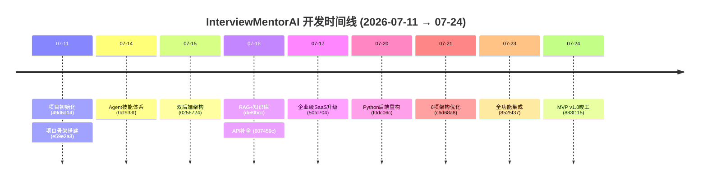
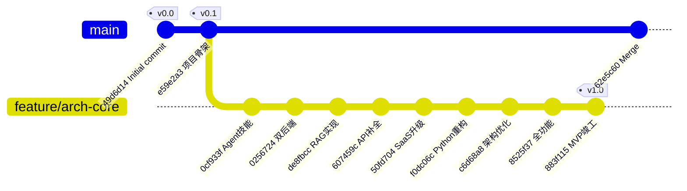
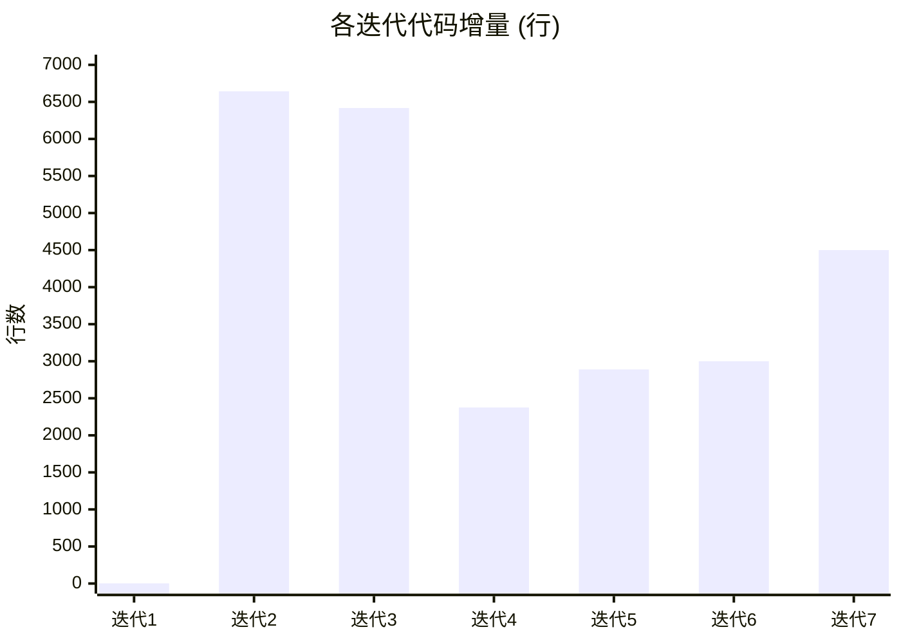

# InterviewMentorAI 项目进度思维导图

> 生成时间: 2026-07-29 · 覆盖全部 Git 分支 & 提交历史

```mermaid
mindmap
  root((InterviewMentorAI<br/>AI面试复盘助手))
    
    ::id1 项目概览
      定位: AI驱动的模拟面试复盘助手
      周期: 2026-07-11 → 至今
      总提交: 12次 | 2分支
       代码量: 373+文件 ~19,800行
      作者: luo-x-qing / User

    ::id2 分支策略
      main
        基线分支
        含: Initial commit + Merge
      feature/arch-core ← HEAD
        主力开发分支
        含: 迭代4~7 全部功能提交

    ::id3 迭代时间线
      迭代1: 2026-07-11 项目初始化
        commit 49d6d14
        → GitHub仓库 + README
      迭代2: 2026-07-11 项目骨架
        commit e59e2a3
        → Spring Boot + Flutter
        → 170文件 / 6,643行
      迭代3: 2026-07-14 Agent技能体系
        commit 0cf933f
        → Matt Pocock 20+技能
        → 138文件 / 6,417行
      迭代4: 2026-07-15 双后端架构
        commit 0256724
        → Java业务 + Python AI
        → 41文件 / 2,376行变更
      迭代5: 2026-07-16 RAG学习中心
        暂存工作
        → 9门课程 / 2,890行
      迭代6: 2026-07-16~20 RAG实现
        commits: de8fbcc→607459c→f0dc06c
        → RAG+MCP+知识库+重构
       迭代7: 2026-07-21~24 MVP竣工
         commits: c6d68a8→8525f37→883f115
         → 6项优化+全功能

    ::id4 技术架构演进
      阶段1: 单体分离
        Java(业务) + Flutter(前端)
      阶段2: 双后端
        Java业务后端 + Python AI后端
       阶段3: JWT认证与实时推送
         + JWT双Token认证
         + STOMP WebSocket
      阶段4: RAG增强
        + 向量数据库(sqlite-vec)
        + 混合检索(BM25+向量)
        + MCP调度层
        + Agent5步流水线

    ::id5 模块架构
      frontend_flutter
        平台: Android / iOS / Web / Desktop
        框架: Flutter 3.12 + Dart
        核心: 录音 → 上传 → 展示
         页面: 首页/录音/报告/个人中心
        服务: API/Audio/Auth/WebSocket
      backend_springai (Java)
        框架: Spring Boot 3.2.5 + Java 17
        数据: MyBatis-Plus + MySQL
         安全: JWT + Spring Security
         实时: STOMP WebSocket
         API: 5 Controller / 23 REST API
      backend_python (Python)
        框架: FastAPI + Uvicorn
        AI: DashScope ASR + LLM
        RAG: sqlite-vec + BM25 + jieba
        流水线: Agent 5步(ASR→分离→RAG→评估→报告)
        知识库: 11份面试题库
        测试: pytest 103+用例
      docs / lessons
        ADR: 1份架构决策
        课程: 18门(RAG 9 + SaaS 9)
        架构评审: 4次HTML报告
      DevOps
        CI: GitHub Actions (3并行Job)
        容器: Docker 三容器编排

    ::id6 关键里程碑
      M1: 2026-07-11 Initial commit
      M2: 2026-07-11 项目骨架(Spring Boot+Flutter)
      M3: 2026-07-14 Agent技能体系(20+技能)
      M4: 2026-07-15 双后端(Java业务+Python AI)
      M5: 2026-07-16 RAG+知识库+课程
      M6: 2026-07-21 Python后端6项架构优化
      M7: 2026-07-23 全功能集成
      M8: 2026-07-24 MVP v1.0竣工

    ::id7 核心技术栈
      Java后端: Spring Boot 3.2.5 / MyBatis-Plus / MySQL / JWT / STOMP
      Python后端: FastAPI / DashScope / sqlite-vec / rank-bm25 / LangChain
      Flutter前端: Dart 3.12 / Dio / record 5.1 / stomp_dart_client
      工具链: Maven / pytest / GitHub Actions / Docker

    ::id8 下一步规划
      短期: 完成RAG集成 → 混合检索
      中期: 面试知识库扩容 → E2E测试
      长期: 高级RAG模式(Self-RAG/Graph RAG) → 性能优化
```

---

## 提交时间线 (chronological)



## Git 分支拓扑



## 代码量演进


